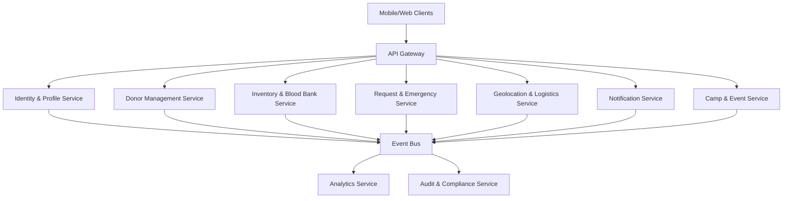

# LifeFlow Blood Donation Management System - Design Document

## Overview

LifeFlow is designed as a cloud-native, microservices-based blood donation management platform that prioritizes high availability, scalability, and regulatory compliance. The system employs event-driven architecture to ensure loose coupling between services while maintaining data consistency through distributed transaction patterns. The platform serves multiple stakeholders including donors, hospitals, blood banks, NGOs, and logistics coordinators through a unified yet modular ecosystem.

## Architecture

### High-Level Architecture

The system follows a microservices architecture pattern with the following key principles:

- **Service Autonomy**: Each microservice owns its data and business logic
- **Event-Driven Communication**: Services communicate through an event bus using publish-subscribe patterns
- **API Gateway**: Single entry point for all client requests with authentication and routing
- **Distributed Data Management**: Each service maintains its own database optimized for its specific needs
- **Circuit Breaker Pattern**: Fault tolerance through graceful degradation and automatic recovery

### Microservices Breakdown



## Components and Interfaces

### 1. Identity & Profile Service
**Responsibility**: User authentication, authorization, and profile management
- **Database**: PostgreSQL for ACID compliance
- **Key APIs**: 
  - `POST /auth/login` - User authentication
  - `GET /profiles/{userId}` - Profile retrieval
  - `PUT /profiles/{userId}` - Profile updates
- **Events Emitted**: `USER_REGISTERED`, `USER_AUTHENTICATED`, `PROFILE_UPDATED`

### 2. Donor Management Service
**Responsibility**: Donor medical profiles, eligibility, and donation history
- **Database**: PostgreSQL with encrypted medical data
- **Key APIs**:
  - `POST /donors/{donorId}/eligibility-check` - AI-powered eligibility assessment
  - `GET /donors/{donorId}/history` - Donation history
  - `PUT /donors/{donorId}/status` - Update eligibility status
- **Events Emitted**: `DONOR_ELIGIBLE`, `DONATION_COMPLETED`, `ELIGIBILITY_EXPIRED`

### 3. Inventory & Blood Bank Service
**Responsibility**: Blood unit tracking, expiry management, and stock optimization
- **Database**: PostgreSQL with time-series data for analytics
- **Key APIs**:
  - `POST /inventory/blood-units` - Register new blood unit
  - `GET /inventory/availability` - Check stock levels
  - `PUT /inventory/{unitId}/reserve` - Reserve blood unit
- **Events Emitted**: `BLOOD_RECEIVED`, `STOCK_LOW`, `UNIT_EXPIRED`, `UNIT_RESERVED`

### 4. Request & Emergency Service
**Responsibility**: Hospital requests, emergency protocols, and blood matching
- **Database**: PostgreSQL with priority queuing
- **Key APIs**:
  - `POST /requests/emergency` - Emergency blood request
  - `GET /requests/{requestId}/status` - Request status
  - `PUT /requests/{requestId}/fulfill` - Fulfill request
- **Events Emitted**: `EMERGENCY_REQUEST`, `REQUEST_FULFILLED`, `DONOR_NEEDED`

### 5. Geolocation & Logistics Service
**Responsibility**: Location services, route optimization, and delivery tracking
- **Database**: MongoDB for geospatial data
- **Key APIs**:
  - `GET /geo/nearby-donors` - Find donors by location
  - `POST /logistics/dispatch` - Dispatch delivery
  - `GET /logistics/{deliveryId}/track` - Track delivery
- **Events Emitted**: `DONORS_LOCATED`, `DELIVERY_DISPATCHED`, `DELIVERY_COMPLETED`

### 6. Notification Service
**Responsibility**: Multi-channel messaging and alert management
- **Database**: Redis for message queuing
- **Key APIs**:
  - `POST /notifications/send` - Send notification
  - `GET /notifications/{userId}/preferences` - User preferences
- **Events Consumed**: All events for notification triggers

### 7. Camp & Event Service
**Responsibility**: Donation drive management and volunteer coordination
- **Database**: PostgreSQL for event management
- **Key APIs**:
  - `POST /camps` - Create donation camp
  - `GET /camps/{campId}/volunteers` - Volunteer management
  - `PUT /camps/{campId}/status` - Update camp status
- **Events Emitted**: `CAMP_SCHEDULED`, `VOLUNTEER_REGISTERED`, `CAMP_COMPLETED`

## Data Models

### Core Entities

```typescript
interface Donor {
  id: string;
  userId: string;
  bloodType: BloodType;
  medicalHistory: MedicalRecord[];
  eligibilityStatus: EligibilityStatus;
  lastDonationDate: Date;
  totalDonations: number;
  gamificationPoints: number;
  badges: Badge[];
}

interface BloodUnit {
  id: string;
  rfidTag: string;
  bloodType: BloodType;
  donorId: string;
  collectionDate: Date;
  expiryDate: Date;
  status: BloodUnitStatus;
  location: string;
  testResults: TestResult[];
}

interface EmergencyRequest {
  id: string;
  hospitalId: string;
  bloodType: BloodType;
  quantity: number;
  urgencyLevel: UrgencyLevel;
  patientInfo: PatientInfo;
  requestTime: Date;
  fulfillmentDeadline: Date;
  status: RequestStatus;
}

interface DonationCamp {
  id: string;
  organizerId: string;
  name: string;
  location: GeoLocation;
  scheduledDate: Date;
  capacity: number;
  volunteers: Volunteer[];
  registeredDonors: string[];
  status: CampStatus;
}
```

### Event Schema

```typescript
interface DomainEvent {
  id: string;
  type: string;
  aggregateId: string;
  version: number;
  timestamp: Date;
  payload: any;
  metadata: EventMetadata;
}
```
## Correctness Properties

*A property is a characteristic or behavior that should hold true across all valid executions of a system-essentially, a formal statement about what the system should do. Properties serve as the bridge between human-readable specifications and machine-verifiable correctness guarantees.*

### Property Reflection

After analyzing all acceptance criteria, several properties can be consolidated to eliminate redundancy:

- Properties related to notification delivery (3.2, 2.3, 4.2, 6.2) can be combined into a comprehensive notification reliability property
- Properties about data encryption and privacy (1.4, 8.1, 8.2) can be unified into a data protection property
- Properties about audit logging (3.5, 8.3) can be merged into a comprehensive audit trail property
- Properties about inventory updates (1.5, 4.1, 6.4) can be combined into an inventory consistency property

### Core Properties

**Property 1: Eligibility Validation Consistency**
*For any* donor profile with medical information, the eligibility checker should consistently apply medical criteria and produce deterministic results for identical inputs
**Validates: Requirements 1.1, 1.2**

**Property 2: Appointment Assignment Optimization**
*For any* eligible donor requesting an appointment, the system should assign the geographically nearest donation center with available capacity
**Validates: Requirements 1.3**

**Property 3: Gamification Reward Consistency**
*For any* completed donation, the system should award points and badges according to predefined rules based on donation type, frequency, and donor history
**Validates: Requirements 2.1, 2.4**

**Property 4: Point Redemption Integrity**
*For any* redemption transaction, the system should verify sufficient point balance, process the redemption, and accurately deduct points without double-spending
**Validates: Requirements 2.2**

**Property 5: Emergency Response Time Compliance**
*For any* emergency blood request, the system should identify compatible donors within 5km radius and complete the search within 30 seconds
**Validates: Requirements 3.1**

**Property 6: Notification Delivery Reliability**
*For any* high-priority notification event, the system should deliver notifications through appropriate channels with priority flags and delivery confirmation
**Validates: Requirements 3.2, 2.3, 4.2, 6.2**

**Property 7: Emergency Escalation Protocol**
*For any* blood request when inventory is insufficient, the system should automatically escalate to nearby blood banks and activate emergency protocols
**Validates: Requirements 3.3**

**Property 8: Blood Unit Uniqueness and Tracking**
*For any* blood unit received, the system should assign a globally unique RFID identifier and maintain accurate shelf life calculations
**Validates: Requirements 4.1**

**Property 9: Blood Type Compatibility Matching**
*For any* blood request, the system should apply correct medical compatibility rules including universal donor protocols (O- universal, AB+ universal recipient)
**Validates: Requirements 4.5**

**Property 10: Inventory Threshold Monitoring**
*For any* blood type inventory level, when stock drops below safety thresholds, the system should automatically trigger donor recruitment campaigns
**Validates: Requirements 4.4**

**Property 11: Camp Resource Generation**
*For any* scheduled donation camp, the system should generate complete digital marketing assets and functional registration forms
**Validates: Requirements 5.1**

**Property 12: Volunteer Assignment Logic**
*For any* volunteer registration, the system should assign appropriate roles based on skills and provide coordinated scheduling
**Validates: Requirements 5.2**

**Property 13: Capacity Management and Waitlisting**
*For any* donation camp reaching maximum capacity, the system should activate waitlist management and send notifications for additional slots
**Validates: Requirements 5.3**

**Property 14: Real-time Progress Tracking**
*For any* active donation camp, the system should maintain accurate real-time tracking of donation progress and volunteer performance metrics
**Validates: Requirements 5.4**

**Property 15: Comprehensive Report Generation**
*For any* completed donation camp, the system should generate reports containing all required data elements including donor feedback and collection statistics
**Validates: Requirements 5.5**

**Property 16: GPS Tracking and ETA Accuracy**
*For any* dispatched blood unit, the system should provide continuous GPS tracking and calculate estimated arrival times based on current conditions
**Validates: Requirements 6.1**

**Property 17: Route Optimization Efficiency**
*For any* delivery route calculation, the system should optimize for minimum travel time while considering real-time traffic conditions
**Validates: Requirements 6.3**

**Property 18: Delivery Confirmation and Inventory Updates**
*For any* blood unit delivery, the system should require digital signature confirmation and immediately update inventory status
**Validates: Requirements 6.4**

**Property 19: Chain of Custody Completeness**
*For any* completed blood transport, the system should maintain complete and immutable chain of custody documentation
**Validates: Requirements 6.5**

**Property 20: Service Fault Isolation**
*For any* microservice failure, the system should continue operating other services without cascading failures or system-wide outages
**Validates: Requirements 7.1**

**Property 21: Circuit Breaker Activation**
*For any* inter-service communication failure, the system should activate circuit breakers and implement graceful degradation patterns
**Validates: Requirements 7.2**

**Property 22: Distributed Transaction Consistency**
*For any* multi-service transaction, the system should either complete all operations successfully or roll back all changes using SAGA patterns
**Validates: Requirements 7.3**

**Property 23: Service Recovery and Synchronization**
*For any* recovered microservice, the system should automatically resynchronize data and resume normal operations without manual intervention
**Validates: Requirements 7.4**

**Property 24: System Health Monitoring**
*For any* system health issue, the monitoring system should display real-time status on dashboards and trigger automated alerts
**Validates: Requirements 7.5**

**Property 25: Data Encryption Compliance**
*For any* personal health information stored or transmitted, the system should apply AES-256 encryption and maintain HIPAA compliance standards
**Validates: Requirements 1.4, 8.1**

**Property 26: Data Anonymization and Consent**
*For any* donor information shared with hospitals, the system should anonymize data until explicit consent is provided and verified
**Validates: Requirements 8.2**

**Property 27: Comprehensive Audit Logging**
*For any* user action or system event, the system should create immutable audit log entries with timestamps and maintain complete audit trails
**Validates: Requirements 3.5, 8.3**

**Property 28: Data Retention and Purging**
*For any* personal information reaching retention expiry, the system should automatically purge personal data while preserving anonymized statistics
**Validates: Requirements 8.4**

**Property 29: Compliance Reporting Completeness**
*For any* regulatory audit request, the system should generate comprehensive compliance reports with all required information and data access logs
**Validates: Requirements 8.5**

**Property 30: Inventory Consistency Across Services**
*For any* inventory-affecting operation (donation, reservation, delivery), all related services should maintain consistent inventory state
**Validates: Requirements 1.5, 4.1, 6.4**

## Error Handling

### Distributed System Error Patterns

**Circuit Breaker Implementation**
- Each service implements circuit breakers for external dependencies
- Three states: Closed (normal), Open (failing), Half-Open (testing recovery)
- Automatic fallback to cached data or degraded functionality

**Saga Pattern for Distributed Transactions**
- Compensating transactions for rollback scenarios
- Event sourcing for transaction state management
- Timeout handling for long-running transactions

**Data Consistency Strategies**
- Eventually consistent for non-critical operations
- Strong consistency for financial transactions (points, redemptions)
- Conflict resolution for concurrent updates

### Service-Specific Error Handling

**Emergency Request Service**
- Fallback to manual donor contact if automated systems fail
- Escalation to regional blood banks if local inventory insufficient
- Priority queuing to handle high-volume emergency scenarios

**Notification Service**
- Multi-channel delivery with fallback (SMS → Email → Push)
- Retry logic with exponential backoff
- Dead letter queues for failed notifications

**Inventory Service**
- Optimistic locking for concurrent inventory updates
- Automatic reconciliation for inventory discrepancies
- Alert generation for data integrity issues

## Testing Strategy

### Dual Testing Approach

The LifeFlow system requires both unit testing and property-based testing to ensure comprehensive coverage:

**Unit Testing Requirements:**
- Unit tests verify specific examples, edge cases, and error conditions
- Integration tests verify service interactions and API contracts
- Mock external dependencies for isolated testing
- Focus on business logic validation and error scenarios

**Property-Based Testing Requirements:**
- Use **fast-check** library for JavaScript/TypeScript property-based testing
- Configure each property test to run minimum 100 iterations for statistical confidence
- Each property-based test must include a comment with format: **Feature: lifeflow-blood-donation-system, Property {number}: {property_text}**
- Property tests verify universal properties across all valid inputs
- Generate realistic test data that respects domain constraints

**Testing Framework Configuration:**
- **Jest** for unit testing with coverage reporting
- **fast-check** for property-based testing
- **Testcontainers** for integration testing with real databases
- **Pact** for contract testing between microservices

**Test Data Generation:**
- Smart generators that respect medical constraints (blood types, eligibility rules)
- Geolocation generators for realistic distance calculations
- Time-based generators for donation schedules and expiry dates
- Compliance-aware generators for audit and privacy testing

### Service Testing Strategies

**Identity & Profile Service:**
- Authentication flow testing with various credential types
- Authorization testing for role-based access control
- Profile data validation and encryption verification

**Donor Management Service:**
- Eligibility algorithm testing with medical rule variations
- Donation history integrity and timeline validation
- Gamification point calculation accuracy

**Inventory & Blood Bank Service:**
- RFID uniqueness and collision detection
- Expiry date calculations and alert timing
- Stock level monitoring and threshold management

**Request & Emergency Service:**
- Blood type matching algorithm validation
- Emergency response time measurement
- Priority queue ordering and fairness

**Geolocation & Logistics Service:**
- Distance calculation accuracy within acceptable margins
- Route optimization performance benchmarks
- GPS tracking data integrity and real-time updates

**Notification Service:**
- Multi-channel delivery reliability testing
- Priority handling and bypass mechanism validation
- Message formatting and personalization accuracy

**Camp & Event Service:**
- Capacity management and waitlist functionality
- Volunteer scheduling conflict resolution
- Report generation completeness and accuracy

### Performance and Load Testing

**Scalability Requirements:**
- Support 10,000 concurrent users during emergency scenarios
- Process 1,000 blood requests per minute during peak hours
- Maintain sub-second response times for emergency donor searches
- Handle 100,000 daily notifications across all channels

**Stress Testing Scenarios:**
- Mass casualty event simulation with simultaneous emergency requests
- Large-scale donation camp with thousands of concurrent registrations
- System recovery testing after partial service failures
- Database failover and data synchronization validation

### Security and Compliance Testing

**Security Testing:**
- Penetration testing for API endpoints and authentication
- Encryption validation for data at rest and in transit
- Access control testing for role-based permissions
- Input validation and injection attack prevention

**Compliance Testing:**
- HIPAA compliance validation for health data handling
- GDPR compliance for data retention and deletion
- Audit trail completeness and immutability verification
- Data anonymization effectiveness testing

This comprehensive testing strategy ensures that LifeFlow meets the highest standards for reliability, security, and regulatory compliance while maintaining the performance required for a mission-critical healthcare system.