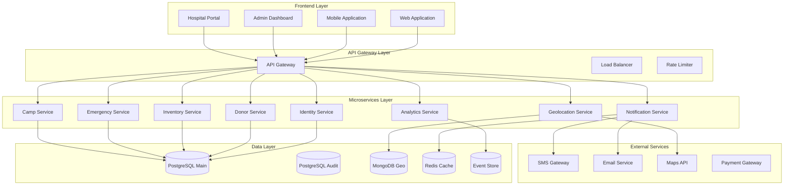
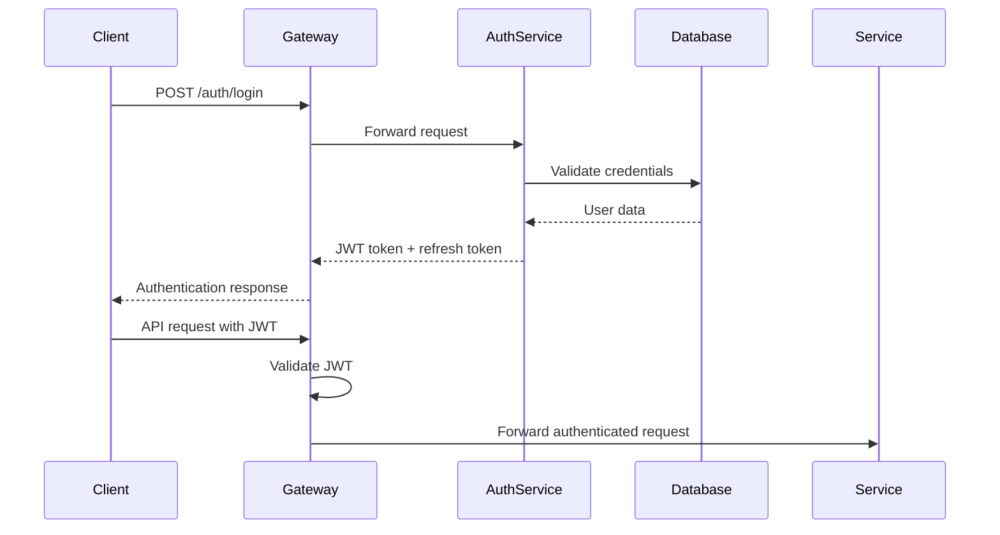
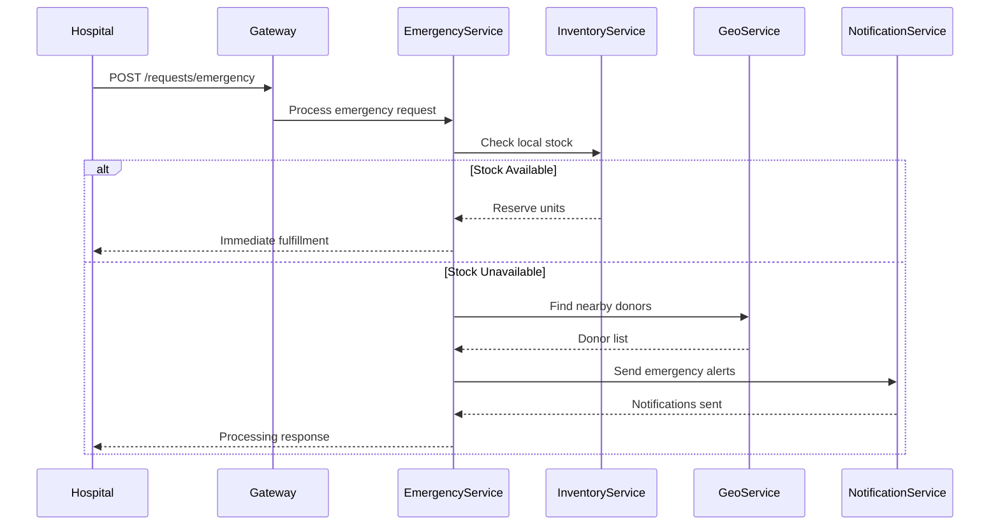
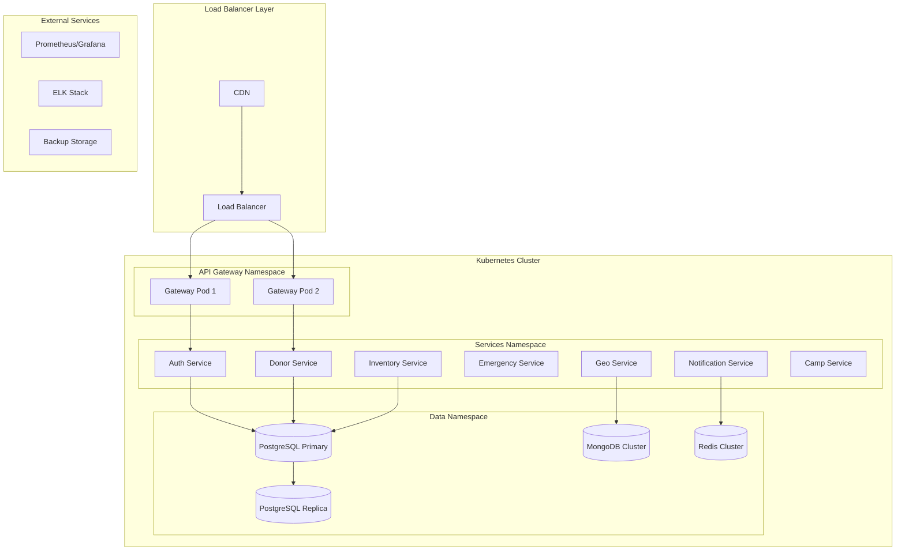
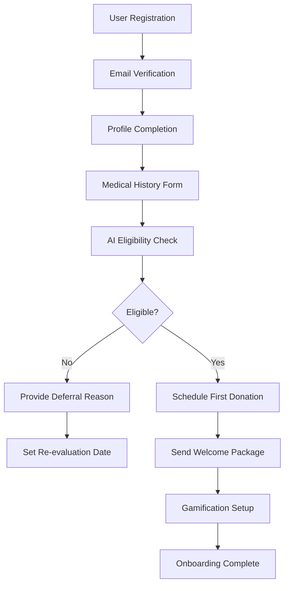
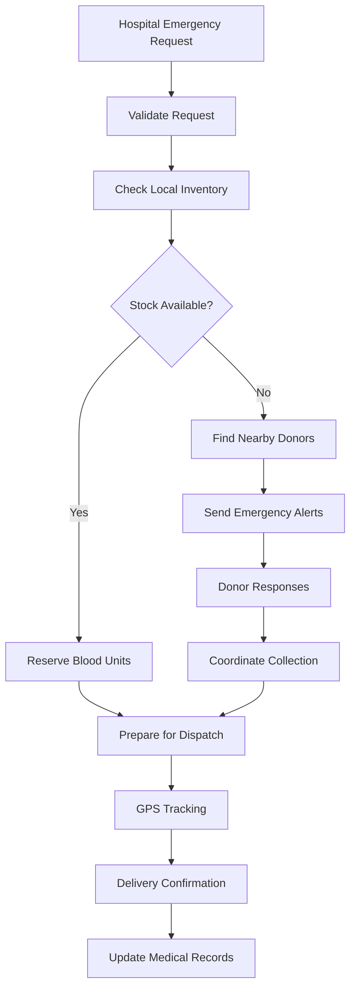
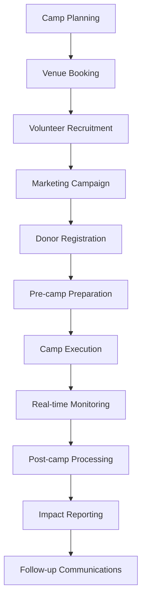
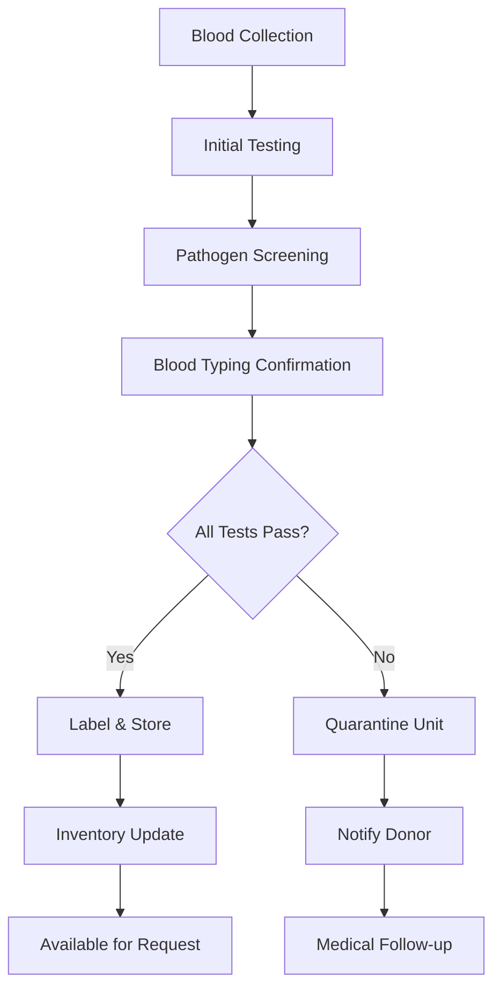

# LifeFlow Blood Donation Management System - Complete ERP Documentation

## Table of Contents
1. [System Overview](#system-overview)
2. [Architecture Overview](#architecture-overview)
3. [Database Schema](#database-schema)
4. [Microservices Architecture](#microservices-architecture)
5. [API Documentation](#api-documentation)
6. [Frontend Applications](#frontend-applications)
7. [Technology Stack](#technology-stack)
8. [Deployment Architecture](#deployment-architecture)
9. [Security & Compliance](#security--compliance)
10. [Business Processes](#business-processes)

---

## System Overview

LifeFlow is a next-generation Blood Donation Management System designed as a mission-critical, high-availability ERP platform. The system manages the complete blood donation lifecycle from donor registration to patient delivery, incorporating AI-powered eligibility checking, real-time emergency response, gamification, and comprehensive logistics management.

### Key Features
- **Smart Donor Management** with AI-powered eligibility screening
- **Emergency Response System** with geo-fenced alerts and 30-second response time
- **Gamification Platform** with points, badges, and impact tracking
- **Intelligent Inventory Management** with predictive analytics
- **Real-time Logistics Tracking** with GPS and chain of custody
- **Camp & Event Management** for donation drives
- **Comprehensive Compliance** with HIPAA/GDPR requirements

---

## Architecture Overview



---

## Database Schema

### PostgreSQL Main Database

#### Users Table
```sql
CREATE TABLE users (
    id UUID PRIMARY KEY DEFAULT gen_random_uuid(),
    email VARCHAR(255) UNIQUE NOT NULL,
    password_hash VARCHAR(255) NOT NULL,
    role user_role NOT NULL,
    first_name VARCHAR(100) NOT NULL,
    last_name VARCHAR(100) NOT NULL,
    phone VARCHAR(20),
    date_of_birth DATE,
    gender gender_type,
    address JSONB,
    is_active BOOLEAN DEFAULT true,
    email_verified BOOLEAN DEFAULT false,
    phone_verified BOOLEAN DEFAULT false,
    created_at TIMESTAMP DEFAULT CURRENT_TIMESTAMP,
    updated_at TIMESTAMP DEFAULT CURRENT_TIMESTAMP,
    last_login TIMESTAMP
);

CREATE TYPE user_role AS ENUM ('donor', 'hospital_staff', 'blood_bank_staff', 'ngo_coordinator', 'admin', 'logistics_coordinator');
CREATE TYPE gender_type AS ENUM ('male', 'female', 'other', 'prefer_not_to_say');
```

#### Donors Table
```sql
CREATE TABLE donors (
    id UUID PRIMARY KEY DEFAULT gen_random_uuid(),
    user_id UUID REFERENCES users(id) ON DELETE CASCADE,
    blood_type blood_type_enum NOT NULL,
    weight_kg DECIMAL(5,2),
    height_cm INTEGER,
    medical_conditions JSONB DEFAULT '[]',
    medications JSONB DEFAULT '[]',
    travel_history JSONB DEFAULT '[]',
    eligibility_status eligibility_status_enum DEFAULT 'pending',
    eligibility_expires_at TIMESTAMP,
    last_donation_date DATE,
    total_donations INTEGER DEFAULT 0,
    gamification_points INTEGER DEFAULT 0,
    badges JSONB DEFAULT '[]',
    emergency_contact JSONB,
    preferred_donation_center UUID,
    notification_preferences JSONB DEFAULT '{}',
    created_at TIMESTAMP DEFAULT CURRENT_TIMESTAMP,
    updated_at TIMESTAMP DEFAULT CURRENT_TIMESTAMP
);

CREATE TYPE blood_type_enum AS ENUM ('A+', 'A-', 'B+', 'B-', 'AB+', 'AB-', 'O+', 'O-');
CREATE TYPE eligibility_status_enum AS ENUM ('eligible', 'ineligible', 'pending', 'temporarily_deferred', 'permanently_deferred');
```

#### Blood Units Table
```sql
CREATE TABLE blood_units (
    id UUID PRIMARY KEY DEFAULT gen_random_uuid(),
    rfid_tag VARCHAR(50) UNIQUE NOT NULL,
    barcode VARCHAR(50) UNIQUE NOT NULL,
    donor_id UUID REFERENCES donors(id),
    blood_type blood_type_enum NOT NULL,
    collection_date TIMESTAMP NOT NULL,
    expiry_date TIMESTAMP NOT NULL,
    volume_ml INTEGER NOT NULL DEFAULT 450,
    status blood_unit_status_enum DEFAULT 'collected',
    location_id UUID REFERENCES locations(id),
    test_results JSONB DEFAULT '{}',
    processing_notes TEXT,
    temperature_log JSONB DEFAULT '[]',
    chain_of_custody JSONB DEFAULT '[]',
    reserved_for UUID REFERENCES blood_requests(id),
    created_at TIMESTAMP DEFAULT CURRENT_TIMESTAMP,
    updated_at TIMESTAMP DEFAULT CURRENT_TIMESTAMP
);

CREATE TYPE blood_unit_status_enum AS ENUM ('collected', 'testing', 'available', 'reserved', 'dispatched', 'delivered', 'expired', 'discarded');
```

#### Blood Requests Table
```sql
CREATE TABLE blood_requests (
    id UUID PRIMARY KEY DEFAULT gen_random_uuid(),
    hospital_id UUID REFERENCES hospitals(id) NOT NULL,
    requesting_doctor_id UUID REFERENCES users(id),
    blood_type blood_type_enum NOT NULL,
    quantity INTEGER NOT NULL,
    urgency_level urgency_level_enum NOT NULL,
    patient_info JSONB NOT NULL,
    medical_reason TEXT,
    required_by TIMESTAMP NOT NULL,
    status request_status_enum DEFAULT 'pending',
    fulfilled_units JSONB DEFAULT '[]',
    rejection_reason TEXT,
    created_at TIMESTAMP DEFAULT CURRENT_TIMESTAMP,
    updated_at TIMESTAMP DEFAULT CURRENT_TIMESTAMP,
    fulfilled_at TIMESTAMP
);

CREATE TYPE urgency_level_enum AS ENUM ('critical', 'urgent', 'routine');
CREATE TYPE request_status_enum AS ENUM ('pending', 'processing', 'partially_fulfilled', 'fulfilled', 'cancelled', 'expired');
```

#### Hospitals Table
```sql
CREATE TABLE hospitals (
    id UUID PRIMARY KEY DEFAULT gen_random_uuid(),
    name VARCHAR(255) NOT NULL,
    license_number VARCHAR(100) UNIQUE NOT NULL,
    address JSONB NOT NULL,
    contact_info JSONB NOT NULL,
    emergency_contact JSONB NOT NULL,
    specializations TEXT[],
    bed_capacity INTEGER,
    trauma_center_level INTEGER,
    blood_bank_license VARCHAR(100),
    is_active BOOLEAN DEFAULT true,
    created_at TIMESTAMP DEFAULT CURRENT_TIMESTAMP,
    updated_at TIMESTAMP DEFAULT CURRENT_TIMESTAMP
);
```

#### Donation Camps Table
```sql
CREATE TABLE donation_camps (
    id UUID PRIMARY KEY DEFAULT gen_random_uuid(),
    organizer_id UUID REFERENCES users(id) NOT NULL,
    name VARCHAR(255) NOT NULL,
    description TEXT,
    location JSONB NOT NULL,
    scheduled_date DATE NOT NULL,
    start_time TIME NOT NULL,
    end_time TIME NOT NULL,
    capacity INTEGER NOT NULL,
    registered_donors INTEGER DEFAULT 0,
    actual_donations INTEGER DEFAULT 0,
    status camp_status_enum DEFAULT 'planned',
    marketing_assets JSONB DEFAULT '{}',
    volunteer_requirements JSONB DEFAULT '{}',
    equipment_checklist JSONB DEFAULT '{}',
    created_at TIMESTAMP DEFAULT CURRENT_TIMESTAMP,
    updated_at TIMESTAMP DEFAULT CURRENT_TIMESTAMP
);

CREATE TYPE camp_status_enum AS ENUM ('planned', 'registration_open', 'registration_closed', 'active', 'completed', 'cancelled');
```

#### Volunteers Table
```sql
CREATE TABLE volunteers (
    id UUID PRIMARY KEY DEFAULT gen_random_uuid(),
    user_id UUID REFERENCES users(id) ON DELETE CASCADE,
    camp_id UUID REFERENCES donation_camps(id) ON DELETE CASCADE,
    role volunteer_role_enum NOT NULL,
    skills TEXT[],
    availability JSONB NOT NULL,
    assigned_tasks JSONB DEFAULT '[]',
    performance_rating DECIMAL(3,2),
    feedback TEXT,
    created_at TIMESTAMP DEFAULT CURRENT_TIMESTAMP,
    updated_at TIMESTAMP DEFAULT CURRENT_TIMESTAMP
);

CREATE TYPE volunteer_role_enum AS ENUM ('registration', 'medical_screening', 'donation_assistance', 'refreshment', 'logistics', 'coordinator');
```

#### Deliveries Table
```sql
CREATE TABLE deliveries (
    id UUID PRIMARY KEY DEFAULT gen_random_uuid(),
    blood_unit_ids UUID[] NOT NULL,
    from_location_id UUID REFERENCES locations(id) NOT NULL,
    to_location_id UUID REFERENCES locations(id) NOT NULL,
    driver_id UUID REFERENCES users(id),
    vehicle_info JSONB,
    scheduled_pickup TIMESTAMP NOT NULL,
    actual_pickup TIMESTAMP,
    estimated_delivery TIMESTAMP NOT NULL,
    actual_delivery TIMESTAMP,
    status delivery_status_enum DEFAULT 'scheduled',
    route_info JSONB,
    gps_tracking JSONB DEFAULT '[]',
    temperature_monitoring JSONB DEFAULT '[]',
    delivery_confirmation JSONB,
    created_at TIMESTAMP DEFAULT CURRENT_TIMESTAMP,
    updated_at TIMESTAMP DEFAULT CURRENT_TIMESTAMP
);

CREATE TYPE delivery_status_enum AS ENUM ('scheduled', 'in_transit', 'delivered', 'failed', 'cancelled');
```

#### Locations Table
```sql
CREATE TABLE locations (
    id UUID PRIMARY KEY DEFAULT gen_random_uuid(),
    name VARCHAR(255) NOT NULL,
    type location_type_enum NOT NULL,
    address JSONB NOT NULL,
    coordinates POINT NOT NULL,
    contact_info JSONB,
    operating_hours JSONB,
    capacity_info JSONB,
    equipment JSONB DEFAULT '{}',
    is_active BOOLEAN DEFAULT true,
    created_at TIMESTAMP DEFAULT CURRENT_TIMESTAMP,
    updated_at TIMESTAMP DEFAULT CURRENT_TIMESTAMP
);

CREATE TYPE location_type_enum AS ENUM ('blood_bank', 'hospital', 'donation_center', 'mobile_unit', 'warehouse');
```

#### Gamification Tables
```sql
CREATE TABLE badges (
    id UUID PRIMARY KEY DEFAULT gen_random_uuid(),
    name VARCHAR(100) NOT NULL,
    description TEXT,
    icon_url VARCHAR(255),
    criteria JSONB NOT NULL,
    points_required INTEGER,
    rarity badge_rarity_enum DEFAULT 'common',
    is_active BOOLEAN DEFAULT true,
    created_at TIMESTAMP DEFAULT CURRENT_TIMESTAMP
);

CREATE TYPE badge_rarity_enum AS ENUM ('common', 'rare', 'epic', 'legendary');

CREATE TABLE donor_badges (
    id UUID PRIMARY KEY DEFAULT gen_random_uuid(),
    donor_id UUID REFERENCES donors(id) ON DELETE CASCADE,
    badge_id UUID REFERENCES badges(id),
    earned_at TIMESTAMP DEFAULT CURRENT_TIMESTAMP,
    UNIQUE(donor_id, badge_id)
);

CREATE TABLE point_transactions (
    id UUID PRIMARY KEY DEFAULT gen_random_uuid(),
    donor_id UUID REFERENCES donors(id) ON DELETE CASCADE,
    transaction_type point_transaction_type_enum NOT NULL,
    points INTEGER NOT NULL,
    description TEXT,
    reference_id UUID,
    created_at TIMESTAMP DEFAULT CURRENT_TIMESTAMP
);

CREATE TYPE point_transaction_type_enum AS ENUM ('earned_donation', 'earned_referral', 'earned_milestone', 'redeemed_reward', 'expired', 'adjusted');
```

### MongoDB Collections (Geolocation Service)

#### Donor Locations Collection
```javascript
{
  _id: ObjectId,
  donorId: UUID,
  location: {
    type: "Point",
    coordinates: [longitude, latitude]
  },
  address: {
    street: String,
    city: String,
    state: String,
    zipCode: String,
    country: String
  },
  accuracy: Number,
  timestamp: Date,
  isActive: Boolean
}
```

#### Delivery Routes Collection
```javascript
{
  _id: ObjectId,
  deliveryId: UUID,
  route: {
    type: "LineString",
    coordinates: [[longitude, latitude], ...]
  },
  waypoints: [{
    location: {
      type: "Point",
      coordinates: [longitude, latitude]
    },
    timestamp: Date,
    status: String
  }],
  estimatedDuration: Number,
  actualDuration: Number,
  distance: Number,
  trafficConditions: Object
}
```

### Redis Data Structures (Caching & Sessions)

#### Session Management
```
Key: session:{sessionId}
Value: {
  userId: UUID,
  role: String,
  permissions: Array,
  lastActivity: Timestamp,
  deviceInfo: Object
}
TTL: 24 hours
```

#### Notification Queue
```
Key: notifications:queue:{priority}
Value: List of notification objects
```

#### Cache Keys
```
donor:profile:{donorId} - Donor profile cache
inventory:summary:{locationId} - Inventory summary
emergency:donors:{bloodType}:{lat}:{lng} - Emergency donor cache
```

---

## Microservices Architecture

### 1. Identity & Profile Service

**Port:** 3001  
**Database:** PostgreSQL  
**Responsibilities:**
- User authentication and authorization
- JWT token management
- Role-based access control
- Profile management
- Password reset and email verification

**Key Endpoints:**
```
POST /auth/register
POST /auth/login
POST /auth/refresh
GET /auth/profile
PUT /auth/profile
POST /auth/forgot-password
POST /auth/reset-password
```

**Environment Variables:**
```
JWT_SECRET=your_jwt_secret
JWT_EXPIRY=24h
BCRYPT_ROUNDS=12
EMAIL_SERVICE_URL=http://notification-service:3006
```

### 2. Donor Management Service

**Port:** 3002  
**Database:** PostgreSQL  
**Responsibilities:**
- Donor registration and profile management
- AI-powered eligibility checking
- Donation history tracking
- Gamification system (points, badges)
- Medical record encryption

**Key Endpoints:**
```
POST /donors/register
GET /donors/{id}/profile
PUT /donors/{id}/profile
POST /donors/{id}/eligibility-check
GET /donors/{id}/history
POST /donors/{id}/donation
GET /donors/{id}/gamification
```

**AI Eligibility Rules:**
```javascript
const eligibilityRules = {
  age: { min: 18, max: 65 },
  weight: { min: 50 }, // kg
  hemoglobin: { min: 12.5 }, // g/dL
  lastDonation: { minDays: 56 }, // 8 weeks
  medications: {
    excluded: ['aspirin', 'antibiotics', 'blood_thinners'],
    waitPeriods: {
      'aspirin': 7, // days
      'antibiotics': 14
    }
  },
  travel: {
    malariaRisk: { waitDays: 365 },
    madCowDisease: { permanent: true }
  },
  lifestyle: {
    tattoo: { waitDays: 120 },
    piercing: { waitDays: 120 },
    surgery: { waitDays: 180 }
  }
};
```

### 3. Inventory & Blood Bank Service

**Port:** 3003  
**Database:** PostgreSQL  
**Responsibilities:**
- Blood unit tracking with RFID/barcode
- Shelf life monitoring and expiry alerts
- Stock level management
- Blood type compatibility matching
- Predictive analytics for demand forecasting

**Key Endpoints:**
```
POST /inventory/blood-units
GET /inventory/availability
PUT /inventory/{unitId}/reserve
GET /inventory/expiring
POST /inventory/transfer
GET /inventory/analytics
```

**Blood Compatibility Matrix:**
```javascript
const compatibilityMatrix = {
  'O-': ['O-', 'O+', 'A-', 'A+', 'B-', 'B+', 'AB-', 'AB+'], // Universal donor
  'O+': ['O+', 'A+', 'B+', 'AB+'],
  'A-': ['A-', 'A+', 'AB-', 'AB+'],
  'A+': ['A+', 'AB+'],
  'B-': ['B-', 'B+', 'AB-', 'AB+'],
  'B+': ['B+', 'AB+'],
  'AB-': ['AB-', 'AB+'],
  'AB+': ['AB+'] // Universal recipient
};
```

### 4. Request & Emergency Service

**Port:** 3004  
**Database:** PostgreSQL  
**Responsibilities:**
- Emergency blood request processing
- Hospital request management
- Blood matching and allocation
- Priority queue management
- 30-second response time guarantee

**Key Endpoints:**
```
POST /requests/emergency
POST /requests/routine
GET /requests/{id}/status
PUT /requests/{id}/fulfill
GET /requests/queue
POST /requests/{id}/escalate
```

**Emergency Response Algorithm:**
```javascript
const emergencyResponse = async (request) => {
  const startTime = Date.now();
  
  // Step 1: Check local inventory (< 5 seconds)
  const localStock = await checkLocalInventory(request.bloodType, request.quantity);
  
  if (localStock.available >= request.quantity) {
    await reserveBloodUnits(localStock.units.slice(0, request.quantity));
    return { status: 'fulfilled', responseTime: Date.now() - startTime };
  }
  
  // Step 2: Find nearby donors (< 15 seconds)
  const nearbyDonors = await findDonorsInRadius(
    request.hospital.location, 
    5000, // 5km radius
    request.bloodType
  );
  
  // Step 3: Send emergency notifications (< 10 seconds)
  await sendEmergencyNotifications(nearbyDonors, request);
  
  // Ensure total response time < 30 seconds
  const responseTime = Date.now() - startTime;
  if (responseTime > 30000) {
    logger.error(`Emergency response exceeded 30s: ${responseTime}ms`);
  }
  
  return { status: 'processing', responseTime, donorsNotified: nearbyDonors.length };
};
```

### 5. Geolocation & Logistics Service

**Port:** 3005  
**Database:** MongoDB  
**Responsibilities:**
- Geospatial donor search
- Route optimization
- GPS tracking
- Delivery management
- Integration with Maps APIs

**Key Endpoints:**
```
GET /geo/nearby-donors
POST /logistics/dispatch
GET /logistics/{deliveryId}/track
POST /geo/update-location
GET /geo/route-optimization
```

**Geospatial Queries:**
```javascript
// Find donors within 5km radius
db.donorLocations.find({
  location: {
    $near: {
      $geometry: {
        type: "Point",
        coordinates: [longitude, latitude]
      },
      $maxDistance: 5000 // 5km in meters
    }
  },
  isActive: true
});

// Route optimization using Google Maps API
const optimizeRoute = async (waypoints) => {
  const response = await googleMaps.directions({
    origin: waypoints[0],
    destination: waypoints[waypoints.length - 1],
    waypoints: waypoints.slice(1, -1),
    optimize: true,
    mode: 'driving',
    traffic_model: 'best_guess',
    departure_time: 'now'
  });
  
  return response.data.routes[0];
};
```

### 6. Notification Service

**Port:** 3006  
**Database:** Redis  
**Responsibilities:**
- Multi-channel notifications (SMS, Email, Push, WhatsApp)
- High-priority emergency alerts
- Notification preferences management
- Delivery confirmation and retry logic

**Key Endpoints:**
```
POST /notifications/send
GET /notifications/{userId}/preferences
PUT /notifications/{userId}/preferences
GET /notifications/{id}/status
POST /notifications/bulk
```

**Notification Channels:**
```javascript
const notificationChannels = {
  sms: {
    provider: 'twilio',
    priority: 1,
    maxRetries: 3,
    retryDelay: 30000 // 30 seconds
  },
  email: {
    provider: 'sendgrid',
    priority: 2,
    maxRetries: 5,
    retryDelay: 60000 // 1 minute
  },
  push: {
    provider: 'firebase',
    priority: 1,
    maxRetries: 3,
    retryDelay: 15000 // 15 seconds
  },
  whatsapp: {
    provider: 'twilio',
    priority: 3,
    maxRetries: 2,
    retryDelay: 120000 // 2 minutes
  }
};

// Emergency notification bypass
const sendEmergencyNotification = async (donor, request) => {
  const notification = {
    userId: donor.userId,
    type: 'emergency_blood_request',
    priority: 'critical',
    bypassSilentMode: true,
    channels: ['sms', 'push'], // Immediate channels only
    content: {
      title: '🚨 URGENT: Blood Needed',
      message: `Emergency blood request for ${request.bloodType}. Hospital: ${request.hospital.name}. Can you help?`,
      actionUrl: `/emergency-response/${request.id}`
    }
  };
  
  return await sendNotification(notification);
};
```

### 7. Camp & Event Service

**Port:** 3007  
**Database:** PostgreSQL  
**Responsibilities:**
- Donation camp management
- Volunteer coordination
- Digital marketing asset generation
- Capacity management and waitlists
- Real-time progress tracking

**Key Endpoints:**
```
POST /camps
GET /camps/{id}
PUT /camps/{id}
POST /camps/{id}/volunteers
GET /camps/{id}/progress
POST /camps/{id}/marketing-assets
```

### 8. Analytics & Reporting Service

**Port:** 3008  
**Database:** Event Store + PostgreSQL  
**Responsibilities:**
- Real-time analytics and dashboards
- Predictive demand forecasting
- Performance metrics and KPIs
- Compliance reporting
- Business intelligence

**Key Endpoints:**
```
GET /analytics/dashboard
GET /analytics/demand-forecast
GET /analytics/donor-trends
GET /analytics/inventory-optimization
POST /analytics/custom-report
```

---

## API Documentation

### Authentication Flow



### Emergency Request Flow



---

## Frontend Applications

### 1. Donor Mobile Application (React Native)

**Features:**
- Donor registration and profile management
- Eligibility self-assessment
- Appointment scheduling
- Gamification dashboard (points, badges, leaderboards)
- Emergency response notifications
- Donation history and impact tracking
- Camp registration and volunteer signup

**Key Screens:**
```
/onboarding - Registration and eligibility check
/dashboard - Main dashboard with stats and notifications
/profile - Profile management and medical history
/appointments - Schedule and manage appointments
/gamification - Points, badges, and rewards
/emergency - Emergency response interface
/history - Donation history and impact
/camps - Nearby camps and registration
```

### 2. Hospital Web Portal (React)

**Features:**
- Blood request management (routine and emergency)
- Real-time inventory visibility
- Delivery tracking and confirmation
- Patient management integration
- Analytics and reporting
- Staff management and permissions

**Key Components:**
```jsx
// Emergency Request Component
const EmergencyRequest = () => {
  const [request, setRequest] = useState({
    bloodType: '',
    quantity: 1,
    urgency: 'critical',
    patientInfo: {}
  });
  
  const submitEmergencyRequest = async () => {
    const response = await api.post('/requests/emergency', request);
    if (response.data.responseTime > 30000) {
      showAlert('Response time exceeded 30 seconds');
    }
  };
  
  return (
    <EmergencyRequestForm 
      onSubmit={submitEmergencyRequest}
      maxResponseTime={30000}
    />
  );
};
```

### 3. Blood Bank Management System (React)

**Features:**
- Comprehensive inventory management
- RFID/barcode scanning integration
- Expiry monitoring and alerts
- Quality control and testing workflows
- Donor management and scheduling
- Camp coordination tools

### 4. Admin Dashboard (React)

**Features:**
- System-wide analytics and monitoring
- User management and permissions
- Compliance reporting and auditing
- System configuration and settings
- Performance monitoring and alerts
- Business intelligence dashboards

---

## Technology Stack

### Backend Services
- **Runtime:** Node.js 18+ with TypeScript
- **Framework:** Express.js with Helmet security middleware
- **Authentication:** JWT with refresh tokens, OAuth2 integration
- **Validation:** Joi schema validation
- **Documentation:** Swagger/OpenAPI 3.0

### Databases
- **Primary:** PostgreSQL 15+ with encryption at rest
- **Geospatial:** MongoDB with 2dsphere indexes
- **Caching:** Redis 7+ with clustering
- **Event Store:** EventStore DB for audit trails
- **Search:** Elasticsearch for advanced querying

### Message Queue & Events
- **Event Bus:** Apache Kafka with Zookeeper
- **Real-time:** Socket.io for live updates
- **Background Jobs:** Bull Queue with Redis

### Frontend
- **Mobile:** React Native with Expo
- **Web:** React 18+ with TypeScript
- **State Management:** Redux Toolkit with RTK Query
- **UI Framework:** Material-UI / Ant Design
- **Maps:** Google Maps API / Mapbox

### DevOps & Infrastructure
- **Containerization:** Docker with multi-stage builds
- **Orchestration:** Kubernetes with Helm charts
- **CI/CD:** GitHub Actions / GitLab CI
- **Monitoring:** Prometheus + Grafana + Jaeger
- **Logging:** ELK Stack (Elasticsearch, Logstash, Kibana)

### Security & Compliance
- **Encryption:** AES-256 for data at rest, TLS 1.3 for transit
- **Secrets Management:** HashiCorp Vault
- **API Security:** Rate limiting, CORS, CSRF protection
- **Compliance:** HIPAA, GDPR compliance frameworks

---

## Deployment Architecture

### Production Environment



### Environment Configuration

#### Development
```yaml
# docker-compose.dev.yml
version: '3.8'
services:
  postgres:
    image: postgres:15
    environment:
      POSTGRES_DB: lifeflow_dev
      POSTGRES_USER: dev_user
      POSTGRES_PASSWORD: dev_password
    ports:
      - "5432:5432"
    volumes:
      - postgres_data:/var/lib/postgresql/data
      
  mongodb:
    image: mongo:6
    ports:
      - "27017:27017"
    volumes:
      - mongo_data:/data/db
      
  redis:
    image: redis:7-alpine
    ports:
      - "6379:6379"
      
  api-gateway:
    build: ./services/api-gateway
    ports:
      - "3000:3000"
    environment:
      - NODE_ENV=development
      - JWT_SECRET=dev_jwt_secret
    depends_on:
      - postgres
      - redis
```

#### Production Kubernetes Manifests
```yaml
# auth-service-deployment.yaml
apiVersion: apps/v1
kind: Deployment
metadata:
  name: auth-service
  namespace: lifeflow-services
spec:
  replicas: 3
  selector:
    matchLabels:
      app: auth-service
  template:
    metadata:
      labels:
        app: auth-service
    spec:
      containers:
      - name: auth-service
        image: lifeflow/auth-service:v1.0.0
        ports:
        - containerPort: 3001
        env:
        - name: DATABASE_URL
          valueFrom:
            secretKeyRef:
              name: database-secrets
              key: postgres-url
        - name: JWT_SECRET
          valueFrom:
            secretKeyRef:
              name: auth-secrets
              key: jwt-secret
        resources:
          requests:
            memory: "256Mi"
            cpu: "250m"
          limits:
            memory: "512Mi"
            cpu: "500m"
        livenessProbe:
          httpGet:
            path: /health
            port: 3001
          initialDelaySeconds: 30
          periodSeconds: 10
        readinessProbe:
          httpGet:
            path: /ready
            port: 3001
          initialDelaySeconds: 5
          periodSeconds: 5
```

---

## Security & Compliance

### Data Protection Implementation

#### Encryption at Rest
```javascript
// Database encryption configuration
const dbConfig = {
  host: process.env.DB_HOST,
  port: process.env.DB_PORT,
  database: process.env.DB_NAME,
  username: process.env.DB_USER,
  password: process.env.DB_PASSWORD,
  dialect: 'postgres',
  dialectOptions: {
    ssl: {
      require: true,
      rejectUnauthorized: false
    }
  },
  // Transparent Data Encryption (TDE)
  encrypt: true,
  // Field-level encryption for sensitive data
  fieldEncryption: {
    key: process.env.FIELD_ENCRYPTION_KEY,
    algorithm: 'aes-256-gcm',
    fields: ['medical_conditions', 'medications', 'emergency_contact']
  }
};

// Encrypt sensitive fields before storage
const encryptSensitiveData = (data) => {
  const cipher = crypto.createCipher('aes-256-gcm', process.env.FIELD_ENCRYPTION_KEY);
  let encrypted = cipher.update(JSON.stringify(data), 'utf8', 'hex');
  encrypted += cipher.final('hex');
  return encrypted;
};
```

#### HIPAA Compliance Checklist
- [x] **Administrative Safeguards**
  - Security Officer designation
  - Workforce training programs
  - Access management procedures
  - Incident response procedures

- [x] **Physical Safeguards**
  - Data center security controls
  - Workstation access controls
  - Device and media controls

- [x] **Technical Safeguards**
  - Access control (unique user identification, emergency access, automatic logoff)
  - Audit controls (hardware, software, procedural mechanisms)
  - Integrity controls (PHI alteration/destruction protection)
  - Person or entity authentication
  - Transmission security (end-to-end encryption)

#### Audit Trail Implementation
```javascript
// Comprehensive audit logging
const auditLogger = {
  logAccess: (userId, resource, action, result) => {
    const auditEntry = {
      timestamp: new Date().toISOString(),
      userId,
      userRole: getUserRole(userId),
      resource,
      action,
      result,
      ipAddress: getClientIP(),
      userAgent: getUserAgent(),
      sessionId: getSessionId()
    };
    
    // Store in immutable audit log
    auditStore.append(auditEntry);
    
    // Real-time monitoring for suspicious activities
    if (isSuspiciousActivity(auditEntry)) {
      securityAlerts.trigger(auditEntry);
    }
  }
};

// Usage in API endpoints
app.get('/donors/:id/medical-history', authenticate, authorize(['doctor', 'nurse']), (req, res) => {
  auditLogger.logAccess(req.user.id, `donor:${req.params.id}:medical-history`, 'READ', 'SUCCESS');
  // ... endpoint logic
});
```

---

## Business Processes

### 1. Donor Onboarding Process



### 2. Emergency Blood Request Process



### 3. Donation Camp Workflow



### 4. Quality Control Process



---

## Performance Metrics & KPIs

### System Performance
- **Emergency Response Time:** < 30 seconds (99.9% SLA)
- **API Response Time:** < 200ms (95th percentile)
- **System Uptime:** 99.99% availability
- **Concurrent Users:** Support 10,000+ simultaneous users
- **Data Processing:** 1,000+ blood requests per minute

### Business Metrics
- **Donor Retention Rate:** Target 80% annual retention
- **Blood Wastage Reduction:** < 2% expiry rate
- **Emergency Fulfillment Rate:** > 95% within 4 hours
- **Donor Satisfaction Score:** > 4.5/5.0
- **Hospital Response Time:** Average 15 minutes for routine requests

### Compliance Metrics
- **Audit Trail Completeness:** 100% of transactions logged
- **Data Breach Incidents:** Zero tolerance policy
- **Regulatory Compliance Score:** 100% HIPAA/GDPR compliance
- **Security Vulnerability Response:** < 24 hours for critical issues

---

This comprehensive ERP documentation provides a complete blueprint for implementing the LifeFlow Blood Donation Management System as a full-stack, enterprise-grade application with robust microservices architecture, comprehensive database design, and strict compliance requirements.